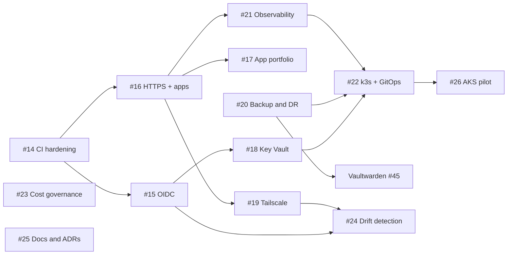

# Roadmap — Month 1: Homelab → Mini-Enterprise

> Planned 2026-07-04. Tracked as GitHub epics [#14](https://github.com/114snehasish/homelab-azure/issues/14)–[#26](https://github.com/114snehasish/homelab-azure/issues/26), each with one child issue per PR (sub-issues). This document is the narrative; the issues are the work.

## Vision

Grow this five-module Terraform homelab into a **mini-enterprise** while learning DevOps, platform engineering, and app engineering. The platform journey is deliberately **simplest-first**: Docker-Compose-as-code → single-node k3s with GitOps → an AKS pilot (stretch). Pillar priority: **apps with HTTPS and real domains** → **security & identity** → **observability** → **resilience & governance**.

## Decisions made for this roadmap

Two long-standing "ask first" inconsistencies from CLAUDE.md were decided (owner-approved 2026-07-04):

1. **Apply gate unified to manual dispatch for all five modules** — dns/cloudflare lose auto-apply-on-push (E01). Plans run and comment on every PR; applies are always a deliberate checkbox.
2. **CI auth moves to OIDC federated identity** — `ARM_CLIENT_SECRET` dies, and with it the `ARM_*` vs `AZURE_*` secret-name split (E02).

### Stack picks

| Decision | Pick | Why (one line) |
|---|---|---|
| Reverse proxy | **Caddy** | Automatic HTTPS; DNS-01 wildcard cert via Cloudflare plugin avoids leaking hostnames to CT logs; one less config language than Traefik. |
| Zero-trust access | **Tailscale** | Zero-config mesh + MagicDNS + official GitHub Action for ephemeral CI nodes; break-glass workflow as the escape hatch. |
| GitOps | **Argo CD** | Sync/drift/health made visible in a UI — worth more to a learner than Flux's purity; bigger job-market keyword. |
| Backup | **Azure Backup vault** | The real enterprise service (policies, retention, restore points) + an on-demand pre-op snapshot workflow for risky applies. |
| CI → Azure identity | **UAMI + federated credential** | Pure `azurerm`; no Graph API permissions or admin consent needed. |
| VM size | **Standard_B4ms (16 GB)** | Same burstable family (no southindia quota surprises); fits compose apps + monitoring + k3s on one box. |
| Alerting channel | **Telegram bot** | Free instant push; Alertmanager/Uptime Kuma native, Azure action groups via webhook. |
| License | **MIT** | The public mirror currently publishes unlicensed code. |

## The 13 epics

| Epic | Title | Pillar | Week | Tier |
|---|---|---|---|---|
| [#14](https://github.com/114snehasish/homelab-azure/issues/14) | E01 CI & repo hardening | security (enabler) | 1 | Core |
| [#15](https://github.com/114snehasish/homelab-azure/issues/15) | E02 OIDC federated identity for CI | security | 1 | Core |
| [#16](https://github.com/114snehasish/homelab-azure/issues/16) | E03 HTTPS ingress + first apps (compose-as-code) | apps | 1–2 | Core |
| [#17](https://github.com/114snehasish/homelab-azure/issues/17) | E04 Self-hosted app portfolio | apps | 2–3 | Flex |
| [#18](https://github.com/114snehasish/homelab-azure/issues/18) | E05 Key Vault secrets layer | security | 2 | Core |
| [#19](https://github.com/114snehasish/homelab-azure/issues/19) | E06 Zero-trust access (Tailscale) | security | 2–3 | Core |
| [#20](https://github.com/114snehasish/homelab-azure/issues/20) | E07 Backup & DR for the pet disk | resilience | 3 (early) | Core |
| [#21](https://github.com/114snehasish/homelab-azure/issues/21) | E08 Observability (Grafana stack + Azure Monitor) | observability | 3 | Core |
| [#22](https://github.com/114snehasish/homelab-azure/issues/22) | E09 k3s + GitOps (Argo CD) | apps/platform | 3–4 | Core |
| [#23](https://github.com/114snehasish/homelab-azure/issues/23) | E10 Cost governance & tagging | governance | 4 | Flex |
| [#24](https://github.com/114snehasish/homelab-azure/issues/24) | E11 Drift detection & ops automation | governance | 4 | Flex |
| [#25](https://github.com/114snehasish/homelab-azure/issues/25) | E12 Docs, architecture & ADRs | governance | 4 + rolling | Core (trimmed) |
| [#26](https://github.com/114snehasish/homelab-azure/issues/26) | E13 AKS pilot | apps/platform | stretch | Stretch |

## Dependency graph

Sequencing rules that are **not optional**:

- **E01.2 (gate flip) merges before any other workflow edit** — today, editing `deploy-dns.yml` on `main` auto-applies it.
- **E07 (backup + performed restore drill) lands before the VM-churning work** — Tailscale (E06.1), resize (E08.1), and k3s (E09.2) all recreate the VM; the pet disk's only protection today is `prevent_destroy`.
- **E06 internal order is lockout-critical**: tailnet proven → CI on tailnet → break-glass exists → only then remove public SSH.
- **Vaultwarden (#45) and k3s install (#68) are hard-blocked on the restore drill (#58).**
- **Pre-op snapshot (#59) before every VM-recreating apply.**

## Risk register

| # | Risk | Mitigation lives in |
|---|---|---|
| R1 | OOM on the 4 GB B2s once monitoring/k3s land | #61 resize to B4ms first; E09 hard-depends on it |
| R2 | Caddy vs k3s Traefik both want 80/443 | #67 ADR: `--disable traefik`, Caddy stays sole edge |
| R3 | SSH lockout during Tailscale cutover | E06 strict child order; #53 break-glass before #54 removal |
| R4 | Pet disk during VM recreates | E07 before churn; #59 pre-op snapshots; never weaken cloud-init's format-only-if-unformatted guard |
| R5 | Auto-apply fires while workflows are edited | #28 gate flip is the first workflow PR |
| R6 | Public mirror leaks attack surface / secrets | Wildcard cert + wildcard DNS (no enumeration); admin UIs tailnet-only (#46); secrets only in Key Vault (E05) |
| R7 | Vaultwarden before a tested restore | #45 blocked on #58 |
| R8 | OIDC cutover bricks all CI at once | #35 validates per-module while old secrets exist; #36 deletes them only after |

## Capacity honesty & cut order

Full scope is **13 epics / 60 PRs ≈ 90–120 hours** — more than a typical solo evenings-and-weekends month (50–70 h). Core = E01–E03, E05–E09 (+ E12.1/.2) ≈ 42 PRs, still ambitious.

**Week-2 checkpoint question:** *"Are HTTPS apps live and OIDC done?"* If no — cut before adding, in this order:

1. Drop E13 (AKS) → month 2
2. Drop E11 (drift detection)
3. Drop E10.3/E10.4 (policy, Infracost)
4. Merge E08.6 into E08.2 (dashboards)
5. Shrink E04 to it-tools only
6. Slide E09.4/E09.5 to month 2 — *k3s installed + Argo CD syncing is a fine month-1 exit state*

## Working agreement

- One child issue = one PR, snake_case branch, PR into `main` (merge commit), issue auto-closed by the PR.
- Labels: `epic`, `core`/`flex`/`stretch`, `week-1..4`, `pillar:*`, `area:*`, `blocked` (with the blocker named in the issue body).
- Every PR: CI green (fmt/validate/tflint/checkov once E01 lands), plan comment reviewed, docs updated if behavior changed.
- Never touch: RG `do-not-delete`, storage account `listeninfratfstatesa`, SSH key `homelab-vm-ssh-key-2`.
