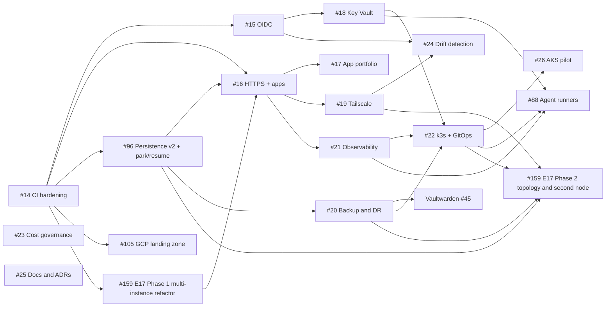

# Roadmap — Month 1: Homelab → Mini-Enterprise

> Planned 2026-07-04. Tracked as GitHub epics [#14](https://github.com/114snehasish/homelab/issues/14)–[#26](https://github.com/114snehasish/homelab/issues/26), each with one child issue per PR (sub-issues). This document is the narrative; the issues are the work.

## Vision

Grow this five-module Terraform homelab into a **mini-enterprise** while learning DevOps, platform engineering, and app engineering. The platform journey is deliberately **simplest-first**: Docker-Compose-as-code → single-node k3s with GitOps → an AKS pilot (stretch). Pillar priority: **apps with HTTPS and real domains** → **security & identity** → **observability** → **resilience & governance**.

**Multi-cloud direction (added 2026-07-07):** the lab expands beyond Azure. E16 replicates the current five-module Azure stack onto **GCP** (existing project, monthly credit) under a new `gcp/` tree — same Terraform/Cloudflare/GitHub-Actions stack, both clouds coexisting. Azure remains the deep enterprise track; GCP starts as a faithful replica and becomes the mix-and-match playground for future expansions. Future epics fan out per-cloud deliberately.

**Operating model (clarified 2026-07-05): compute is ephemeral, storage is not.** The lab is not 24×7 — it runs in *experience cycles*: deploy everything, use it, then **park** it (final backup → destroy the VM, the only real cost driver). The only things that survive a cycle are the persistence layer (app data, databases, metrics/logs history, TLS certs) and the near-free control plane (tfstate, Key Vault, DNS zone, network RG). Parked cost target: **≤ ₹400/mo**. E15 exists to make this lifecycle first-class.

## Decisions made for this roadmap

Two long-standing "ask first" inconsistencies from CLAUDE.md were decided (owner-approved 2026-07-04):

1. **Apply gate unified to manual dispatch for all five modules** — dns/cloudflare lose auto-apply-on-push (E01). Plans run and comment on every PR; applies are always a deliberate checkbox.
2. **CI auth moves to OIDC federated identity** — `ARM_CLIENT_SECRET` dies, and with it the `ARM_*` vs `AZURE_*` secret-name split (E02). *Landed: #35 cut every workflow over to the UAMI; #36 deleted the leftover secrets and retired the old service principal's credential in Entra.*

### Stack picks

| Decision | Pick | Why (one line) |
|---|---|---|
| Reverse proxy | **Caddy** | Automatic HTTPS; DNS-01 wildcard cert via Cloudflare plugin avoids leaking hostnames to CT logs; one less config language than Traefik. |
| Zero-trust access | **Tailscale** | Zero-config mesh + MagicDNS + official GitHub Action for ephemeral CI nodes; break-glass workflow as the escape hatch. |
| GitOps | **Argo CD** | Sync/drift/health made visible in a UI — worth more to a learner than Flux's purity; bigger job-market keyword. |
| Backup | **Azure Backup vault** | The real enterprise service (policies, retention, restore points) + an on-demand pre-op snapshot workflow for risky applies. |
| CI → Azure identity | **UAMI + federated credential** | Pure `azurerm`; no Graph API permissions or admin consent needed. |
| VM size | **Standard_B4ms (16 GB)** | Same burstable family (no southindia quota surprises); fits compose apps + monitoring + k3s on one box. |
| Alerting channel | **Telegram bot** | Free instant push; Alertmanager/Uptime Kuma native, Azure action groups via webhook. |
| License | **MIT** | The public mirror currently publishes unlicensed code. |
| Persistence | **Managed disk (own RG) + restic → Blob Cool** | Block storage is the only safe home for live SQLite/Postgres; restic gives encrypted, deduplicated, versioned logical backups independent of any disk. Azure Files rejected for databases (SMB locking/corruption). |

## The epics

| Epic | Title | Pillar | Week | Tier |
|---|---|---|---|---|
| [#14](https://github.com/114snehasish/homelab/issues/14) | E01 CI & repo hardening | security (enabler) | 1 | Core |
| [#15](https://github.com/114snehasish/homelab/issues/15) | E02 OIDC federated identity for CI | security | 1 | Core |
| [#16](https://github.com/114snehasish/homelab/issues/16) | E03 HTTPS ingress + first apps (compose-as-code) | apps | 1–2 | Core |
| [#17](https://github.com/114snehasish/homelab/issues/17) | E04 Self-hosted app portfolio | apps | 2–3 | Flex |
| [#18](https://github.com/114snehasish/homelab/issues/18) | E05 Key Vault secrets layer | security | 2 | Core |
| [#19](https://github.com/114snehasish/homelab/issues/19) | E06 Zero-trust access (Tailscale) | security | 2–3 | Core |
| [#20](https://github.com/114snehasish/homelab/issues/20) | E07 Backup & DR — **slimmed to crash-consistent disaster layer** (app-consistent backups moved to E15) | resilience | 3 (early) | Core |
| [#21](https://github.com/114snehasish/homelab/issues/21) | E08 Observability (Grafana stack + Azure Monitor) | observability | 3 | Core |
| [#22](https://github.com/114snehasish/homelab/issues/22) | E09 k3s + GitOps (Argo CD) | apps/platform | 3–4 | Core |
| [#23](https://github.com/114snehasish/homelab/issues/23) | E10 Cost governance & tagging | governance | 4 | Flex |
| [#24](https://github.com/114snehasish/homelab/issues/24) | E11 Drift detection & ops automation | governance | 4 | Flex |
| [#25](https://github.com/114snehasish/homelab/issues/25) | E12 Docs, architecture & ADRs | governance | 4 + rolling | Core (trimmed) |
| [#26](https://github.com/114snehasish/homelab/issues/26) | E13 AKS pilot | apps/platform | stretch | Stretch |
| [#88](https://github.com/114snehasish/homelab/issues/88) | E14 Ephemeral Claude Code agent runners on k3s | apps/platform | month 2 | Month-2 opener |
| [#96](https://github.com/114snehasish/homelab/issues/96) | E15 Persistent storage layer v2 + park/resume lifecycle | resilience/platform | 1–2 | **Core — exempt from the cut order** |
| [#105](https://github.com/114snehasish/homelab/issues/105) | E16 GCP landing zone — multi-cloud replica | apps/platform | month 2 / parallel | Month-2 track (`cloud:gcp`) |
| [#159](https://github.com/114snehasish/homelab/issues/159) | E17 Multi-instance compute & network topology v2 | governance/platform | **Phase 1** weeks 1–2 · **Phase 2** month 2 | Core (Phase 1) / Month-2 (Phase 2) |

## Dependency graph

```mermaid
graph LR
  E01[#14 CI hardening] --> E02[#15 OIDC]
  E01 --> E03[#16 HTTPS + apps]
  E02 --> E05[#18 Key Vault]
  E03 --> E04[#17 App portfolio]
  E03 --> E06[#19 Tailscale]
  E03 --> E08[#21 Observability]
  E05 --> E09[#22 k3s + GitOps]
  E07[#20 Backup and DR] --> E04v[Vaultwarden #45]
  E07 --> E09
  E08 --> E09
  E02 --> E11[#24 Drift detection]
  E06 --> E11
  E09 --> E13[#26 AKS pilot]
  E09 --> E14[#88 Agent runners]
  E05 --> E14
  E08 --> E14
  E01 --> E15[#96 Persistence v2 + park/resume]
  E15 --> E03
  E15 --> E07
  E01 --> E16[#105 GCP landing zone]
  E01 --> E17a[#159 E17 Phase 1 multi-instance refactor]
  E17a --> E03
  E06 --> E17b[#159 E17 Phase 2 topology and second node]
  E07 --> E17b
  E09 --> E17b
  E15 --> E17b
  E10[#23 Cost governance]
  E12[#25 Docs and ADRs]
```

Sequencing rules that are **not optional**:

- **E01.2 (gate flip) merges before any other workflow edit** — today, editing `deploy-dns.yml` on `main` auto-applies it.
- **E07 (backup + performed restore drill) lands before the VM-churning work** — Tailscale (E06.1), resize (E08.1), and k3s (E09.2) all recreate the VM; the pet disk's only protection today is `prevent_destroy`.
- **E06 internal order is lockout-critical**: tailnet proven → CI on tailnet → break-glass exists → only then remove public SSH.
- **Vaultwarden (#45) and k3s install (#68) are hard-blocked on the restore drill (#58).**
- **Pre-op snapshot (#59) before every VM-recreating apply.**
- **E15's disk migration + mount contract land before E03.3** — Caddy is the first thing to write real state to `/data`; moving a near-empty disk to the persist RG is trivial, moving a live one is surgery.
- **Park = final restic backup → destroy `compute/vm` only.** Network RG, DNS zone, Key Vault, and the persist RG stay up (all near-free). Resume = apply `compute/vm` → mount guard verifies the disk → apps pick up where they left off, certs included (no ACME re-issuance).
- **E17.2 (#161) lands before E03.1 (#37)** — #37 is the first NSG edit since the NSG was written. Against a rules map it is two entries; against singletons it is two more `azurerm_network_security_rule` blocks with hand-picked priorities, refactored away later anyway.
- **E17 Phase 2 is hard-gated on E06.4 (#54).** A private subnet built before Tailscale needs a bastion host to reach it; built after, the tailnet *is* the access path. This is the whole reason Phase 2 sits in month 2.
- **[ADR-0012](adr/0012-workload-tiering-cidr-and-nsg-ownership.md) (#160) lands before #38, #39 and #99 are built**, or those three bake in single-VM assumptions that get torn up: #38 points the wildcard at one VM's public IP, #39 fixes Caddy as the single edge, and #99 rewrites the mount contract (which must come out parameterized for N disks, or E17.6 rewrites it a second time).

## Risk register

| # | Risk | Mitigation lives in |
|---|---|---|
| R1 | OOM on the 4 GB B2s once monitoring/k3s land | #61 resize to B4ms first; E09 hard-depends on it |
| R2 | Caddy vs k3s Traefik both want 80/443 | #67 ADR: `--disable traefik`, Caddy stays sole edge |
| R3 | SSH lockout during Tailscale cutover | E06 strict child order; #53 break-glass before #54 removal |
| R4 | Pet disk during VM recreates | E07 before churn; #59 pre-op snapshots; never weaken cloud-init's format-only-if-unformatted guard |
| R5 | Auto-apply fires while workflows are edited | #28 gate flip is the first workflow PR |
| R6 | Public mirror leaks attack surface / secrets | Wildcard cert + wildcard DNS (no enumeration); admin UIs tailnet-only (#46); secrets only in Key Vault (E05) |
| R7 | Vaultwarden before a tested restore | #45 blocked on #58 |
| R8 | OIDC cutover bricks all CI at once | #35 validated per-module while the old secrets still existed; #36 deleted them only after. Closed — with the SP credential retired, break-glass is now a local apply as the owner (`az login` + `ARM_SUBSCRIPTION_ID`), which is the only non-CI path to Azure |
| R9 | Agent pods borrow the VM's managed identity via IMDS | #89 NetworkPolicy blocks 169.254.169.254 from the runner namespace |
| R10 | Anthropic API spend invisible to Azure budgets | #93 console spend ceiling + monthly cost review |
| R11 | Prompt injection via untrusted issue text | PR-only GitHub App, human-only merges, owner-applied trigger labels (#90–#92) |
| R12 | Disk migration to the persist RG (snapshot-swap) corrupts/loses data | Done in E15.2 while the disk is near-empty, snapshot taken first, content verified after the swap |
| R13 | restic repo password lost = all logical backups unreadable | Password in Key Vault (after E05) **plus** an offline copy; `restic check` runs weekly so rot is caught early |
| R14 | GCS state bucket lives inside the (existing, destroyable) GCP project | Bucket versioning ON, created out-of-band, never-touch discipline (#107); accepted residual risk |
| R15 | GCP credit exhaustion/expiry mid-cycle | Billing budget alarm at the credit ceiling (#107); parkability is the backstop |
| R16 | GCP zonal disk vs VM zone mismatch (attach failure) | One shared `zone` variable across `gcp/storage` and `gcp/vm` (#111/#112) |
| R17 | Provider bumps merge unverified — Dependabot runs get no secrets, so every `Deploy *` check dies at `terraform init` and the bump itself is never plan-tested | [#138](https://github.com/114snehasish/homelab/issues/138) (E01.8) mirrors the secrets into the Dependabot store; interim workaround is a maintainer push to the PR branch, which re-runs CI with real secrets (used for the azurerm 4→5 bumps #143–#147) |
| R18 | `for_each` conversion churns the pet disk's state address (destroy+create instead of a rename) | `moved` blocks land in the same change as every conversion; `prevent_destroy` on the disk turns a bad move into a **plan error rather than a deletion**; every E17 Phase-1 PR must show a zero-change plan ([#161](https://github.com/114snehasish/homelab/issues/161), [#165](https://github.com/114snehasish/homelab/issues/165)). Note `infra/network` has **no** `prevent_destroy` to catch the same mistake — reading the plan is the only guard there |
| R19 | A **leaked NAT Gateway** — left running while the lab is parked — quietly costs more than everything else combined | NAT Gateway bills hourly (~$0.045/hr), so destroyed-on-park it is ~₹230/mo of *running* cost; left up 24×7 it is ~₹2,800/mo and swamps E15's ≤ ₹400/mo parked target on its own. So the gateway's teardown is owned by park from day one ([#164](https://github.com/114snehasish/homelab/issues/164)), not retrofitted, and parked cost is a measured acceptance criterion. Retired entirely once [#169](https://github.com/114snehasish/homelab/issues/169) swaps in the NAT instance |
| R20 | Fleet-wide blast radius: all compute instances share one state file (deliberate — a directory per instance needs a new backend key, workflow, path filter and concurrency group each) | Manual apply gate stays; per-instance concurrency groups and PR-comment markers ([#163](https://github.com/114snehasish/homelab/issues/163)) so instances cannot race; `.claude/skills/verify-persistence/SKILL.md`'s module-wide `destroy` becomes instance-scoped in [#166](https://github.com/114snehasish/homelab/issues/166) |
| R21 | NAT instance is a single point of failure with a **boot-order dependency** — a fresh private node cannot install anything until the app node is up and forwarding | Why the managed gateway is built first ([#164](https://github.com/114snehasish/homelab/issues/164)) and the swap ([#169](https://github.com/114snehasish/homelab/issues/169)) happens against a known-good baseline. Makes resume order load-bearing in [#167](https://github.com/114snehasish/homelab/issues/167); the app node must be forwarding before private nodes boot |

## Capacity honesty & cut order

Full scope is **13 epics / 60 PRs ≈ 90–120 hours** — more than a typical solo evenings-and-weekends month (50–70 h). Core = E01–E03, E05–E09 (+ E12.1/.2) ≈ 42 PRs, still ambitious. **E15 adds ~7 PRs (~12–18 h) in weeks 1–2 and is exempt from the cut order** — persistence is the philosophy of the lab, and everything after it stands on it; if time is short, cut deeper into the flex epics instead.

**E17 Phase 1 adds ~4 PRs (~6–10 h) in weeks 1–2 and is in the cut order at position 0** — it is a pure refactor that creates nothing and costs nothing to run, so cutting it costs only the compounding interest of leaving single-VM assumptions in place. Cut it if week 2 is at risk, but cut #161 *last*: it is the one whose cost genuinely rises if #37 lands first. **E17 Phase 2 is month-2 work and is not in the month-1 budget at all.**

**Week-2 checkpoint question:** *"Are HTTPS apps live and OIDC done?"* If no — cut before adding, in this order:

1. Drop E13 (AKS) → month 2
2. Drop E11 (drift detection)
3. Drop E10.3/E10.4 (policy, Infracost)
4. Merge E08.6 into E08.2 (dashboards)
5. Shrink E04 to it-tools only
6. Slide E09.4/E09.5 to month 2 — *k3s installed + Argo CD syncing is a fine month-1 exit state*

## E15 — Persistent storage layer v2 + park/resume lifecycle ([#96](https://github.com/114snehasish/homelab/issues/96), weeks 1–2, added 2026-07-05)

The epic that encodes the lab's philosophy. The current pet-disk solution (raw cloud-init bash, LUN discovery, format-if-unformatted as the only guard, disk sharing an RG with disposable resources, no logical backups, no k8s volume story) is replaced by a **tiered persistence architecture**:

- **Tier 0 — always-on control (~free)**: tfstate (external), Key Vault, DNS zone, a new backup storage account.
- **Tier 1 — hot block**: the pet disk, migrated via snapshot-swap into a dedicated **`homelab-persist-rg`** (nothing precious ever again shares an RG with anything destroyable), mounted through a **systemd mount contract with a data-guard** — docker refuses to start unless `/data` is verifiably the real disk. Holds live databases, app state, Prometheus/Loki history, Caddy certs/ACME account, and k3s PVs (`/data/k8s-pv` via local-path-provisioner).
- **Tier 2 — cold logical**: **restic → Azure Blob (Cool tier)**, encrypted/deduplicated/versioned; nightly app-consistent backups (`sqlite3 .backup`, `pg_dump`) plus a final backup as the first act of every park. State remains inspectable and restorable even with zero compute.

**Lifecycle workflows**: `park.yml` (dispatch-gated: final backup → verify → destroy `compute/vm` → cost summary) and `resume.yml` (apply → mount-guard check → app health check). The drill child proves a full park→resume cycle with data and certs intact and records the measured resume time and parked cost.

Children (one PR each): **E15.1** [#97](https://github.com/114snehasish/homelab/issues/97) ADR-0009 tiered persistence · **E15.2** [#98](https://github.com/114snehasish/homelab/issues/98) persist RG + snapshot-swap disk migration + backup storage account (**R12** — the one dangerous op, done while the disk is near-empty) · **E15.3** [#99](https://github.com/114snehasish/homelab/issues/99) mount contract v2 (VM recreate) · **E15.4** [#100](https://github.com/114snehasish/homelab/issues/100) restic-to-blob service (repo password: GitHub secret interim → Key Vault after E05; **R13**) · **E15.5** [#101](https://github.com/114snehasish/homelab/issues/101) park/resume workflows · **E15.6** [#102](https://github.com/114snehasish/homelab/issues/102) full lifecycle drill + runbook · **E15.7** [#103](https://github.com/114snehasish/homelab/issues/103) local-path-provisioner StorageClass (lands with E09).

Interaction with E07: E07 narrows to the **crash-consistent disaster layer** (Backup vault, protect-disk, vault-restore drill, pre-op snapshots); its app-consistent SQLite child (#60) is superseded by E15.4.

## Month 2 preview — E14: ephemeral Claude Code agent runners ([#88](https://github.com/114snehasish/homelab/issues/88))

The month-2 opener extends the platform's philosophy one step further: cattle VM, pet disk, **mayfly agents**. AI agent sessions run as ephemeral actions-runner-controller (ARC) pods on k3s — created per task, destroyed after, nothing persisting outside git/GitHub. Triggered by `@claude` mentions and an `agent:take` backlog label; authenticated with an Anthropic API key from Key Vault; strictly **PR-only** (the agent can never merge and holds no Azure credentials — its PRs pass the same CI gates as human ones). Hard-gated on E09 (k3s + Argo CD + external-secrets), consuming E05 (secrets), E08 (session logs in Loki), and E01 (branch protection).

Children: [#89](https://github.com/114snehasish/homelab/issues/89) ARC + IMDS-blocked runner pool · [#90](https://github.com/114snehasish/homelab/issues/90) PR-only GitHub App + API key via KV + branch protection · [#91](https://github.com/114snehasish/homelab/issues/91) `@claude` mention workflow · [#92](https://github.com/114snehasish/homelab/issues/92) `agent:take` backlog worker · [#93](https://github.com/114snehasish/homelab/issues/93) runbook/ADR/spend guardrails · [#94](https://github.com/114snehasish/homelab/issues/94) read-only Azure identity (flex, after track record).

Deliberately deferred to month 3: the event-driven ops responder (agent auto-fixing E11.2 drift issues and triaging Dependabot PRs) — it becomes a one-workflow addition once the agent has earned trust.

## Multi-cloud — E16: GCP landing zone ([#105](https://github.com/114snehasish/homelab/issues/105), month-2 / parallel track, added 2026-07-07)

A faithful replica of the **current** Azure stack on GCP, inside the owner's **existing project and billing account** (monthly credit): custom-mode VPC + subnet 10.1.0.0/24 (asia-south1, non-overlapping with Azure) with an SSH firewall rule ≈ the NSG; Cloud DNS zone `gcp.snehasish-chakraborty.com` delegated from Cloudflare (twin of the `az` delegation); a 20GB zonal persistent pet disk; an e2-medium Ubuntu 24.04 VM running the same cloud-init (Docker + `/data` mount via the stable `/dev/disk/by-id/google-data` path) with DNS self-registration. CI authenticates via **Workload Identity Federation** (keyless from day one), state lives in a **versioned GCS bucket** in the project (out-of-band bootstrap; never-touch), and all five GCP workflows are dispatch-gated (the Azure auto-apply split is *not* replicated). Two Azure debts are knowingly replicated and flagged: the ipify firewall rule (dies with E06) and the raw cloud-init mount (upgraded when E15's contract fans out to GCP).

Children: [#106](https://github.com/114snehasish/homelab/issues/106) ADR-0011 · [#107](https://github.com/114snehasish/homelab/issues/107) bootstrap (APIs, SA+WIF, state bucket, credit budget) · [#108](https://github.com/114snehasish/homelab/issues/108) network · [#109](https://github.com/114snehasish/homelab/issues/109) dns · [#110](https://github.com/114snehasish/homelab/issues/110) cloudflare delegation · [#111](https://github.com/114snehasish/homelab/issues/111) storage · [#112](https://github.com/114snehasish/homelab/issues/112) vm · [#113](https://github.com/114snehasish/homelab/issues/113) CI workflows · [#114](https://github.com/114snehasish/homelab/issues/114) persistence drill + docs + credit-burn report.

E16.1–E16.7 are independent of the Azure roadmap (pick up anytime as GCP learning); E16.8 prefers E01.3/.4's reusable workflow. Posture: park/resume parity — the GCP side is built parkable, and E15's lifecycle workflows gain a GCP leg in a later extension.

## Multi-instance — E17: compute fleet & network topology v2 ([#159](https://github.com/114snehasish/homelab/issues/159), added 2026-08-13)

Every module here builds **exactly one of each resource**. `compute/vm` parameterizes every name it *consumes* (`subnet_name`, `disk_name`, `nsg_name`, `dns_zone_name`) and **zero** names it *produces* — `homelab-vm`, `-nic`, `-public-ip`, `-osdisk` and the DNS A-record label are literals, and there is no `vm_name` variable. `infra/network` hardcodes `10.0.0.0/16` and one `10.0.0.0/24` with no CIDR variables and no `cidrsubnet()`. The whole repo holds one `for_each` (`infra/cloudflare`) and zero `count`/`matrix`. E17 makes multiplicity possible and builds a real multi-tier network.

**What E17 is not: one VM per app.** `Standard_B4ms` was picked precisely to *"fit compose apps + monitoring + k3s on one box"*, and **E09 is the workload-isolation story** — namespaces, resource limits, NetworkPolicy. Building VM-per-workload before k3s means building isolation twice. So the **default fleet stays at one node**; extra nodes are opt-in map entries that must pass the "earns its own VM" test in [ADR-0012](adr/0012-workload-tiering-cidr-and-nsg-ownership.md). The drivers are **topology learning, blast-radius isolation and per-workload park granularity** — explicitly *not* resource contention.

**CIDR plan** (fixed in [ADR-0012](adr/0012-workload-tiering-cidr-and-nsg-ownership.md) before any subnet is added; must not overlap GCP's `10.1.0.0/24`):

| Tier | CIDR | Holds |
|---|---|---|
| public | `10.0.0.0/24` | today's subnet — internet-facing edge (Caddy), unchanged |
| private | `10.0.1.0/24` | workload nodes with no public IP, reached over the tailnet |
| data | `10.0.2.0/24` | reserved — databases, if they ever leave the app node |
| reserved | `10.0.3.0/24`+ | future (AKS node pool, k3s agents) |

**Phase 1 — refactor, weeks 1–2, ~4 PRs.** `moved` blocks plus defaults that reproduce today's names: **zero new Azure resources, zero cost, a zero-change plan.** Front-loaded because #37 is the first NSG edit since the NSG was written, and every app deployed afterwards bakes in more single-VM assumptions. **E17.1** [#160](https://github.com/114snehasish/homelab/issues/160) ADR-0012 (CIDR plan, NSG ownership → subnet, the "earns its own VM" test, known expiries) · **E17.2** [#161](https://github.com/114snehasish/homelab/issues/161) subnets and NSG rules as maps · **E17.3** [#162](https://github.com/114snehasish/homelab/issues/162) `instance_name` threaded through every produced name · **E17.4** [#163](https://github.com/114snehasish/homelab/issues/163) `_terraform.yml` gains `state_key` + `var_file`, `compute/vm` moves to partial backend config.

E17.4 is the one that unpicks a genuine knot: in `_terraform.yml`, `working_directory` is simultaneously the checkout path, the state identity, the concurrency-lock identity **and** the PR-comment marker. Two instances of one module cannot plan until those are separated — the second dies on a locked state blob, and their sticky plan comments overwrite each other. Container-scoped RBAC on `tfstate` means new state keys need no identity change.

**Phase 2 — topology and the second node, month 2, ~6 PRs.** **E17.5** [#164](https://github.com/114snehasish/homelab/issues/164) private tier + NAT Gateway egress (**R19**) · **E17.10** [#169](https://github.com/114snehasish/homelab/issues/169) swap the gateway for a UDR + NAT instance (**R21**) · **E17.6** [#165](https://github.com/114snehasish/homelab/issues/165) per-instance disks + LUN map (**R18** — a managed disk cannot attach to two VMs, so `infra/storage` multiplies in lockstep) · **E17.7** [#166](https://github.com/114snehasish/homelab/issues/166) the second node · **E17.8** [#167](https://github.com/114snehasish/homelab/issues/167) per-instance park/resume · **E17.9** [#168](https://github.com/114snehasish/homelab/issues/168) diagram, measured cost delta, fleet-wide drill.

**Both egress paths get built, on purpose.** A private node has no public IP, so it needs an explicit outbound path — and the two ways of providing one fail differently enough to be worth doing both. **NAT Gateway lands first** (#164): it is managed, so a private tier that does not work points at the subnet/NSG/routing rather than being confounded with a hand-rolled NVA. **Then the UDR + NAT-instance path replaces it** (#169) — route table, `enable_ip_forwarding`, `MASQUERADE` — and the gateway resources are **deleted**, not left as a toggle. The NAT instance is the steady state (₹0, since the app node already has a public IP); the gateway is a one-time experiment whose measured comparison lands in [ADR-0012](adr/0012-workload-tiering-cidr-and-nsg-ownership.md) (section 5, a deliberate stub until both are measured).

Two silent-failure traps make this sequence worth following exactly. **A UDR sending `0.0.0.0/0` to an NVA bypasses NAT Gateway entirely** — route selection is UDR > BGP > system routes, and NAT Gateway is not a routing construct, so running both at once bills for a gateway that is doing nothing. The swap must be verified by *observed egress IP*, never by "both resources exist". And the NAT instance introduces a **boot-order dependency the gateway does not have**: a fresh private node cannot `apt install` until the app node is forwarding, which is why resume order becomes load-bearing in #167.

*Issue numbers are creation order, not execution order — E17.10 lands immediately after E17.5 and before E17.6. Same convention as E15.7's "(lands with E09)".*

**#166 is a decision gate, not just a build.** It does not start until E09 has landed and been used. If k3s namespaces already deliver the isolation, the honest outcome is a **k3s agent node** joining the existing cluster rather than a bespoke second pet VM — both outcomes close the issue legitimately; silently building the pet VM because it was the original idea does not.

## Working agreement

- One child issue = one PR, snake_case branch, PR into `main` (merge commit), issue auto-closed by the PR.
- Labels: `epic`, `core`/`flex`/`stretch`, `week-1..4`, `pillar:*`, `area:*`, `blocked` (with the blocker named in the issue body).
- Every PR: CI green (fmt/validate/tflint/checkov once E01 lands), plan comment reviewed, docs updated if behavior changed.
- Never touch: RG `do-not-delete`, storage account `listeninfratfstatesa`, SSH key `homelab-vm-ssh-key-2`.
